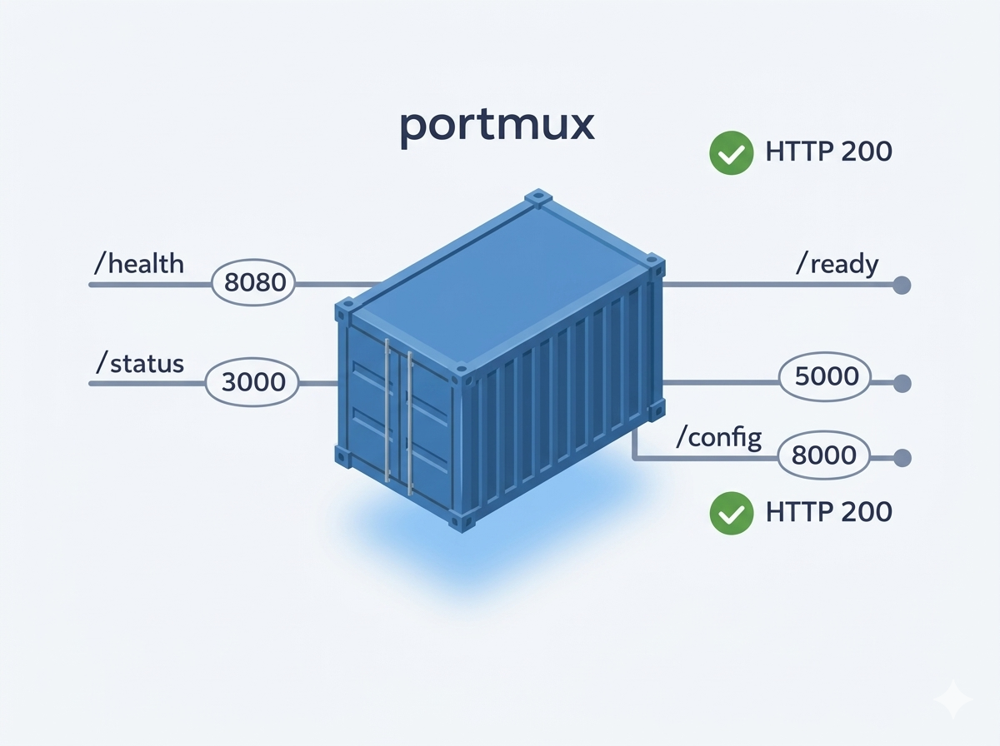

# portmux



**Portmux** is a lightweight Docker image that acts as a universal HTTP stub for testing containerized service scaffolding. It listens simultaneously on ports 80, 3000, 3306, 4040, 5000, 5432, 5601, 6379, 8000, 8080, 8081, 8181, 8888, 9090, 9200, and 27017, and returns HTTP 200 with JSON request metadata on every path regardless of method or URL. Drop it in wherever a real Node.js, React, Next.js, Java, or Spring Boot container would run to validate networking, routing, proxies, load balancers, and health probes — without needing real application code.

## Building & Pushing

**Docker Hub**

```bash
docker login
docker buildx build \
  --platform linux/amd64,linux/arm64 \
  --push \
  -t your-dockerhub-username/portmux:latest \
  .
```

**Amazon ECR**

```bash
aws ecr get-login-password --region us-east-1 \
  | docker login --username AWS --password-stdin 123456789012.dkr.ecr.us-east-1.amazonaws.com

docker buildx build \
  --platform linux/amd64,linux/arm64 \
  --push \
  -t 123456789012.dkr.ecr.us-east-1.amazonaws.com/portmux:latest \
  .
```

**Private registry (e.g. Nexus)**

```bash
docker login nexus.corp.com:5001
docker buildx build \
  --platform linux/amd64,linux/arm64 \
  --push \
  -t nexus.corp.com:5001/portmux:latest \
  .
```

> **Note:** Requires `docker buildx` with a multi-platform builder. If you haven't set one up, run `docker buildx create --use` first.

## Quick Start

### docker compose

```bash
docker compose up
```

## Sample Response

Every request — any path, any HTTP method — returns HTTP 200 with a JSON body:

```bash
curl http://localhost:3000/api/users
```

```json
{
  "port": 3000,
  "method": "GET",
  "path": "/api/users",
  "timestamp": "2026-03-26T12:00:00Z",
  "query_params": {}
}
```

```bash
curl -X POST http://localhost:8080/health
```

```json
{
  "port": 8080,
  "method": "POST",
  "path": "/health",
  "timestamp": "2026-03-26T12:00:01Z",
  "query_params": {}
}
```

**Field reference:**

| Field | Type | Description |
|-------|------|-------------|
| `port` | int | The port that received the request |
| `method` | string | HTTP method (GET, POST, PUT, etc.) |
| `path` | string | Request path |
| `timestamp` | string | ISO 8601 UTC timestamp of the request |
| `query_params` | object | Key-value pairs from the query string |

## Ports

| Port | Common Framework |
|------|----------------|
| 80 | nginx, Apache, generic HTTP |
| 3000 | Node.js (Express, Next.js, React dev) |
| 3306 | MySQL, MariaDB |
| 4040 | Spark UI |
| 5000 | Flask, Python dev servers |
| 5432 | PostgreSQL |
| 5601 | Kibana |
| 6379 | Redis |
| 8000 | Django, uvicorn, generic HTTP alt |
| 8080 | Spring Boot, Tomcat, generic app server |
| 8081 | Alternative app server port |
| 8181 | Karaf, some microservice frameworks |
| 8888 | Jupyter Notebook, secondary proxy |
| 9090 | Prometheus, management dashboards |
| 9200 | Elasticsearch HTTP |
| 27017 | MongoDB |

> **Note:** Port 80 requires root or `CAP_NET_BIND_SERVICE`. If it fails to bind, the other 15 ports still work.

## Adding a New Port

This repo ships a Claude Code skill that keeps all files in sync when you add a port. Tell Claude:

```
add port 9092
```

or multiple at once:

```
add port 9092, 15672
```

Claude will update `main.go`, `test.sh`, `docker-compose.yml`, and `README.md` atomically, then run the test suite to confirm everything works.

## Image Details

| Property | Value |
|----------|-------|
| Base image | `FROM scratch` (~5 MB, zero OS overhead) |
| Architectures | `linux/amd64`, `linux/arm64` |
| Registry | your registry |
| Tags | `:latest`, `:main`, semver (e.g., `:v1.0.0`) |
